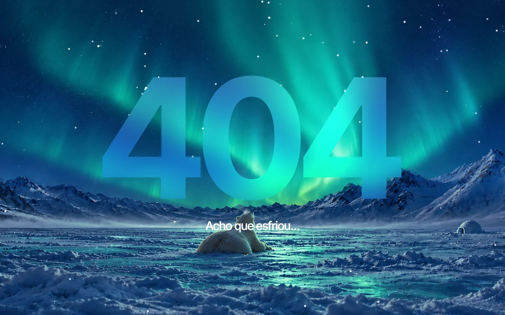
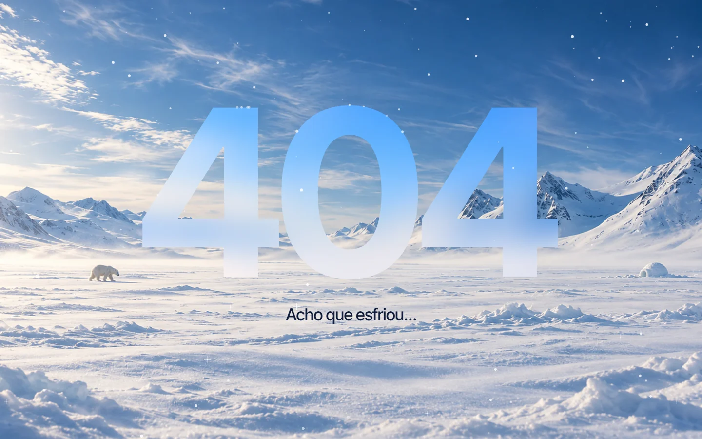
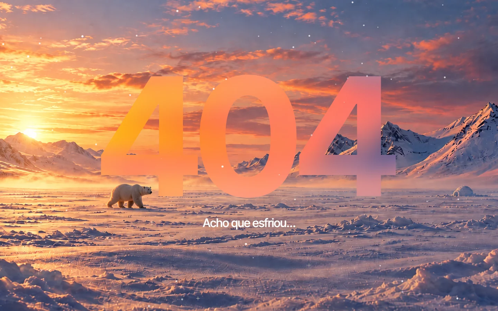
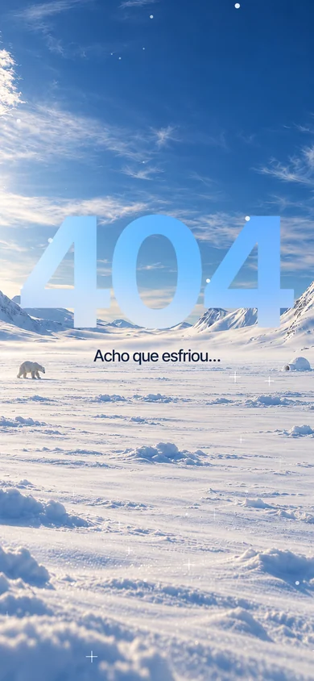
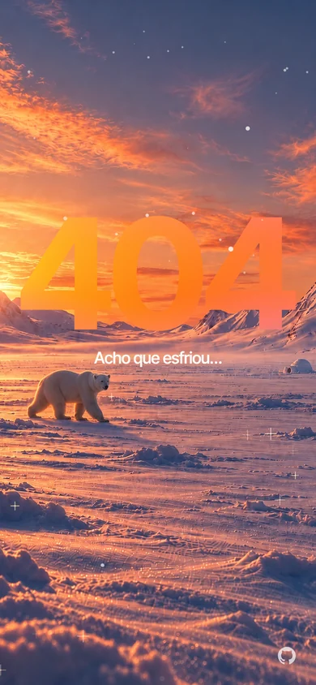
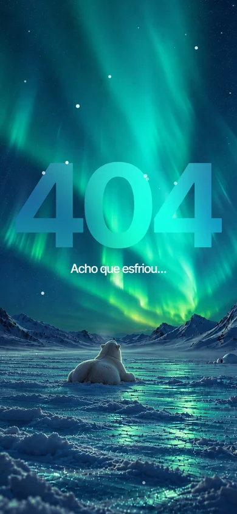

# 404

Página de erro 404 em um cenário ártico que muda com o horário do computador: dia, pôr do sol e noite com aurora boreal. Um "404" de vidro fosco fica parado no centro enquanto a paisagem se move com o mouse.

HTML, CSS e JavaScript puros, num único `index.html`, sem dependências nem build.

**Ao vivo:** https://404-sigma-six.vercel.app



| Dia | Pôr do sol |
| --- | --- |
|  |  |

### No celular

| Dia | Pôr do sol | Noite |
| --- | --- | --- |
|  |  |  |

## Rodar

Sirva a pasta com qualquer servidor estático:

```sh
python -m http.server 4404
```

e abra http://127.0.0.1:4404.

## Horários

A cena segue o relógio local, com transições suaves:

| Cena | Horário |
| --- | --- |
| Noite | 20h – 4h45 |
| Pôr do sol | amanhecer (5h45 – 6h45) e fim de tarde (17h30 – 19h) |
| Dia | 7h45 – 16h30 |

Para revisar outra cena, use `?hora=`: [noite](https://404-sigma-six.vercel.app/?hora=22), [pôr do sol](https://404-sigma-six.vercel.app/?hora=18), [dia](https://404-sigma-six.vercel.app/?hora=12).

## Efeitos

- Paralaxe entre céu e chão com o mouse (ou o giroscópio, no Android) e um zoom lento contínuo.
- Aurora ondulando à noite e sol pulsando de dia e no pôr do sol.
- Neve em três profundidades com vento. Os flocos pousam na neve e se acumulam em cima do 404.
- Brilhos na neve e nas estrelas, neve soprada no horizonte e a respiração do urso no frio.
- Com `prefers-reduced-motion`, as animações são desligadas.

## Imagens

`assets/` tem as três cenas em 16:9, 4:3 e 9:16. A página escolhe o formato mais próximo da tela e carrega primeiro só a cena do horário atual.

## Licença

[MIT](LICENSE)
